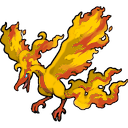

# BDSP Shiny Icons

A collection of Pokémon icons in BDSP (Brilliant Diamond & Shining Pearl) style, recolored to match their shiny variants.

## Overview

This repository contains all original BDSP Pokémon icons and some additional ones that have been recolored to display their shiny forms. The collection includes a total of **1554 icons** covering:

- **All Pokémon generations** (1-9)
- **Alternative forms** and regional variants
- **Mega Evolutions**
- **Pokémon GO exclusive forms**
- **Additional special forms**

## Repository Structure

### `shiny_icons/`

Contains the main collection of shiny Pokémon icons **without the shiny indicator star**, organized by generation:

- `Generation1_0001-0151/` - Kanto Pokémon
- `Generation2_0152-251/` - Johto Pokémon
- `Generation3_0252-0386/` - Hoenn Pokémon
- `Generation4_0387-0493/` - Sinnoh Pokémon
- `Generation5_0494-0649/` - Unova Pokémon
- `Generation6_0650-0721/` - Kalos Pokémon
- `Generation7_0722-0809/` - Alola Pokémon
- `Generation8_0810-0905/` - Galar Pokémon
- `Generation9_0906-1025/` - Paldea Pokémon

### `shiny_icons_with_star/`

Contains the same collection of shiny Pokémon icons but **with the shiny indicator star** included, organized by the same generation structure as above.

### `reference_textures/`

Contains the original BDSP icons, textures, and Pokémon Home icons used as reference material for creating the shiny variants. This folder includes both normal and shiny texture references that were essential for the recoloring process.

## Examples

### Without Shiny Star (`shiny_icons/`)

### With Shiny Star (`shiny_icons_with_star/`)

## Creation Process

The majority of these shiny icons were created using our custom [Sprite Recolor Tool](https://github.com/BlupBlurp/sprite-recolor-tool). This tool takes:

- An original sprite/icon
- A normal Pokémon texture reference
- A shiny Pokémon texture reference

The tool then recolors the sprite to match the shiny color palette.

## Usage

These icons are **free to use** for personal and community projects.

No attribution required, though it's always appreciated!

Attribution is required, so please credit the contributors in your projects.

## Credits

This project was made possible through the collaborative efforts of:

- **ttin**
- **Blup**
- **darth_pokemon**
- **Heavenly_Experience**
- **realmadrid1809**
- **puningtilde**
- **profblack**
- **dahnidandypants**
